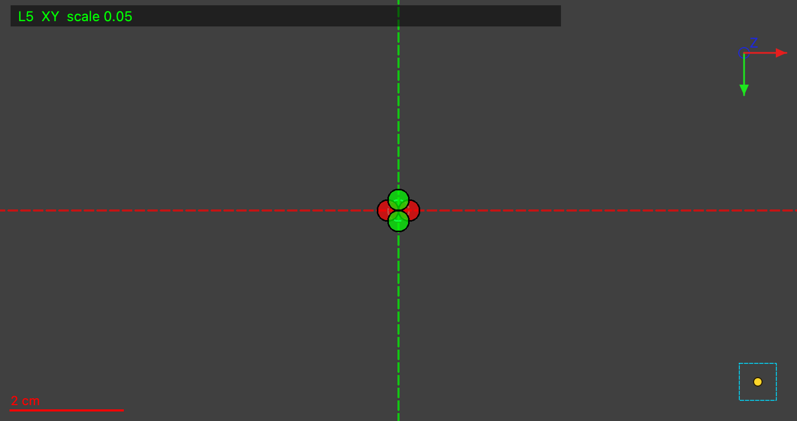

# Sense Check

**Which way does each scroll turn — and can that even be determined —
for the 23 First Letters eligible volumes in the Vesuvius Challenge open
data?**

## The 23 volumes

18 of 23 have a catalog-derivable sense; 5 don't. Of 23 readings: **21
unsure, 1 disagrees, 0 agree.**

| Sample | Catalog | CT reading | Agree |
|---|---|---|---|
| PHerc0125 | UNDERIVABLE | unsure | n/a |
| PHerc0191 | CW | unsure | n/a |
| PHerc0211 | ACW | unsure | n/a |
| PHerc0257 | CW | unsure | n/a |
| PHerc0268 | CW | unsure | n/a |
| PHerc0358 | ACW | unsure | n/a |
| PHerc0800 | CW | unsure | n/a |
| PHerc0813 | CW | **ACW** | ❌ |
| PHerc0826 | ACW | unsure | n/a |
| PHerc0175A | ACW | unsure | n/a |
| PHerc0175B | ACW | unsure | n/a |
| PHerc0306B | ACW | unsure | n/a |
| PHerc0343 | CW | unsure | n/a |
| PHerc0483A | ACW | unsure | n/a |
| PHerc0483B | CW | unsure | n/a |
| PHerc0490A | UNDERIVABLE | unsure | n/a |
| PHerc0490B | UNDERIVABLE | unsure | n/a |
| PHerc0846A | UNDERIVABLE | unsure | n/a |
| PHerc1203 | UNDERIVABLE | **ACW** | n/a |
| PHerc1218 | CW | unsure | n/a |
| PHerc1447 | ACW | unsure | n/a |
| PHerc1545 | ACW | unsure | n/a |
| PHerc0846B | CW | unsure | n/a |

> Reader: Claude (review session), from umbilicus crops, blind to the
> predicted sense; every row reviewed by Lutfiya Miller. "unsure" is a
> result, not a gap.

Full table, z-levels, confidence, umbilicus source: `table/orientation.md`.
PHerc0813, the one disagreement, at the z-level read:


## Five findings

**(a) The catalog is incomplete; the minified catalog is worse.** 5 of 23
volumes lack the fields sense needs (18/23 eligible, 41/71 total).
`metadata.min.json` omits both fields for **all 23** — proof:
`python3 catalog_orientation.py`.

**(b) A single slice rarely settles it.** 21 of 23 blind reads: unsure
(table above; `analysis/readme_pr_findings.md` Finding D).

**(c) Fitting both ways doesn't settle it either.**

| Fit | 1,500 steps | 30,000 steps |
|---|---|---|
| 0826 catalog (ACW) | 0.09691 | 0.09684 |
| 0826 contradicting (CW) | 0.09623 | 0.09791 |
| 0813 catalog (CW) | 0.16338 | 0.16317 |
| 0813 contradicting (ACW) | 0.16561 | 0.16207 |

Both scrolls tie at every checkpoint; the gap flips sign between 1.5k and
30k steps on both — noise, not signal.

**(d) PHerc0826's catalog-vs-community disagreement stays unresolved.**
Catalog says ACW; an August fit said CW off an unequal (30k-vs-1.5k)
comparison. Retested at equal steps, geometry, and a real render: still
unresolved, and unresolvable by fitting this way. Full writeup, with the
overlay images: `analysis/pherc0826/README.md`.

**(e) Two VC3D bugs.** `stable` (`fc25b4d`) crashes opening a sample
whose lasagna representation triggers `resolveLasagnaForVolume`; fixed on
main (PR #1225) and in `latest`, not yet in a cut `stable` release.
Separately, re-opening an already-opened sample renders blank, no error:



Details: `analysis/vc3d-crash/README.md`, `pr/villa_issue.md`.

## Writing a scroll spec

```
python3 write_scroll_spec.py <scroll> <volume>
python3 write_scroll_spec.py <scroll> <volume> --sense CW|ACW --reading-ref "<how you know>"
```

First form: the 18 derivable volumes. Second: required for the 5
UNDERIVABLE ones.

## Filed upstream

Draft PR (`pr/villa_readme_pr.md`) and issue (`pr/villa_issue.md`) — not
yet opened against `ScrollPrize/villa`.

## Limitations

- One AI reader, reviewed by Lutfiya Miller — not a second human reader.
- Renders sample the CT in Python (`render_flattened_tifxyz.py`), not
  villa's `vc_render_tifxyz` (needs Qt6, unavailable here).
- Not tested: what sense affects downstream — normal direction,
  recto/verso.

## Cost

~$8.84 — one RunPod RTX 3090, ~17 pod-hours at $0.52/h.

## AI-use disclosure

Readings, code, fits, and this document were produced with AI assistance,
directed and reviewed by Lutfiya Miller.

## License

MIT. See `LICENSE`.
