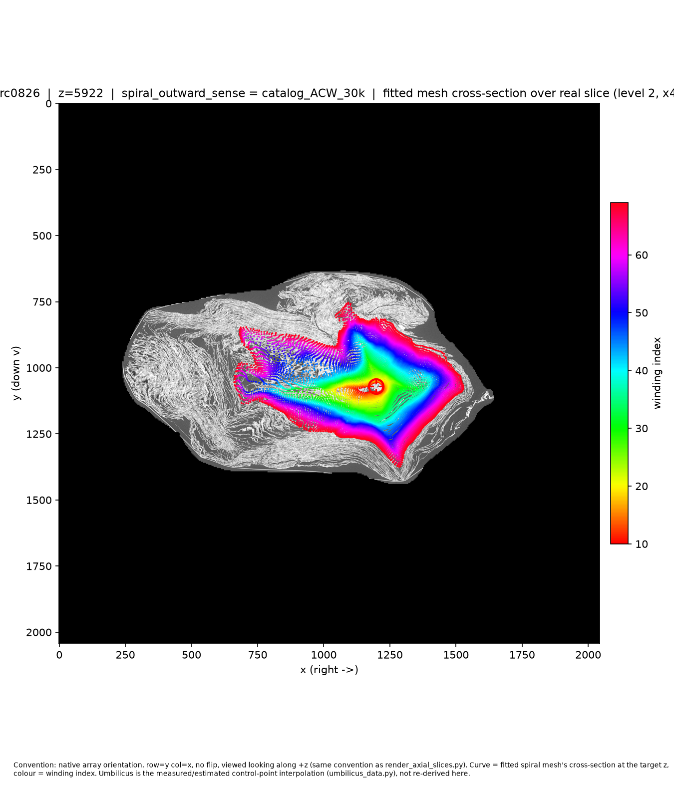

# PHerc0826 and PHerc0813: the fit does not know the sense

1. Equal-step fits tie at 1,500 and 30,000 steps on both scrolls; the
   gap flips sign between them.
2. The fit's winding direction follows the given sense; the two senses'
   point clouds sit ~15 voxels apart, not identical.
3. So an already-fitted spiral returns the sense it was given — the
   August CW conclusion for PHerc0826 is retracted.

The open-data catalog derives **ACW** for PHerc0826 (`z_direction_is_top_to_bottom:
true`, `left_handed_coordinates: false`, villa's rule `"ACW" if z_direction_is_top_to_bottom
!= left_handed_coordinates else "CW"`, `surface_orientation.py` at f4570bf). The
August entry settled on **CW** by fitting the spiral both ways and comparing.
Those two conclusions disagree; the rest of this dossier lays out what
three separate tests did and did not settle.

## August's comparison was not a fair fight

August's CW conclusion came from a 30,000-step CW fit against a 1,500-step
ACW fit. A wrong-handed spiral only pays for itself once per turn, at a
sheet jump — something 1,500 steps may never reach. Before trusting that
result, it needed to be re-run at equal steps.

## Four equal-step fits, and they tie

Both senses, both scrolls (PHerc0826 and PHerc0813, the second scroll run
as an independent check, not because its sense was in question), re-fit
from the same 1,500-step checkpoint via staged resume to 10,000, 20,000,
and 30,000 steps — same optimizer and learning-rate schedule carried
through at every stage, not restarted:

| Fit | 1,500 steps | 30,000 steps |
|---|---|---|
| PHerc0826 catalog (ACW) | 0.09691 | 0.09684 |
| PHerc0826 contradicting (CW) | 0.09623 | 0.09791 |
| PHerc0813 catalog (CW) | 0.16338 | 0.16317 |
| PHerc0813 contradicting (ACW) | 0.16561 | 0.16207 |

(`satisfied_tracks_fraction` — the share of tracked points the fitted
surface actually explains. Full per-checkpoint numbers, configs, and
commands: this directory and `../pherc0813/` — see Evidence below.)

Same fit, both senses, at 30,000 steps, mesh overlaid on the slice at
z=5922:

| Catalog sense (ACW) | Contradicting sense (CW) |
|---|---|
|  |  |

Both are coherent mesh fits on the same slice. Neither is visibly worse
than the other — that agreement with the numbers above is the point: the
fit does not pick a side.

Both scrolls tie at every checkpoint, 1,500 through 30,000 steps. And on
both scrolls the gap between the two senses **flips direction** between
1,500 and 30,000 steps: at 1,500 steps the catalog sense of PHerc0826
(ACW) is ahead by 0.07 percentage points; at 30,000 steps the
contradicting sense (CW) is ahead by 0.11 points. PHerc0813 does the same
thing in the same direction. A gap that changes sign with twenty times
more training is stronger evidence against a real discriminator than a
small, stable gap would have been — this was never close to resolving
either way; it was noise the whole time.

## The parameter reverses U, moves the mesh ~15 voxels, and changes neither fit nor render

A fourth hypothesis, tested after the tie held: `spiral_outward_sense`
might change only the export parametrization — which way the winding
index is traversed — rather than the fitted geometry, so a wrong value
would mirror the exported page rather than fit worse.

**What actually moves:** comparing the two senses' fitted point clouds
directly (`compare_mesh_geometry.py`, per-winding mesh grids, before any
combined-surface export step), the winding parametrization's direction of
travel (does column index run with or against theta around the umbilicus)
reverses cleanly and consistently on both scrolls — correlation ≈ +0.999
one sense, ≈ −0.999 the other, no ambiguity. The two point clouds
themselves sit close but not coincident: symmetric nearest-neighbour
distance median ≈ 15 voxels (≈140 µm at 9.362 µm/voxel) on both scrolls,
95th percentile ≈ 27 voxels, max ≈ 74–84 voxels. That is small next to the
1,500-voxel fit window, but it is not the sub-voxel identity a pure
relabeling would produce — some real, small difference between the two
optimizations remains, plausibly ordinary from-scratch-vs-resumed
optimizer variance rather than a designed effect of the sense flag.

**Why the render doesn't show it, and what that does and doesn't mean:**
both senses' 30k checkpoints were flattened through villa's real
`flatten_spiral_checkpoint.py` (an actual Lasagna flatten optimization,
not a mock) and rendered by sampling the real CT volume at the flattened
grid's coordinates. Normalized cross-correlation between the two senses'
renders is highest **as-is**, not against a horizontal flip, on both
scrolls (PHerc0826: 0.888 as-is vs. 0.733 flipped; PHerc0813: 0.928 vs.
0.768). The renders are not mirror images of each other.

This is not as strong a contradiction of the fourth hypothesis as it
first looks. Villa's own README, at the exact commit this build is pinned
to (f4570bf — which is PR #1899, "Spiral orientation," merged the day
before this build started), documents that every exported combined
surface — the one `flatten_spiral_checkpoint.py` flattens — normalizes
its layout from the catalog's own `z_direction_is_top_to_bottom` field
regardless of which sense produced it: "column 0 is the outermost wrap,"
row 0 is the scroll's top when the z direction is known, and per PR
#1899's own description, "the export always reverses columns." A render
built from a layout that is normalized this way was never guaranteed to
show a naive left-right mirror even if the fourth hypothesis were fully
true — the combined-export step, and Lasagna's own flatten optimization
on top of it, both have the opportunity to converge on a visually similar
layout regardless of the input sense. The clean, per-winding U-direction
reversal — measured before this normalization step, directly on
`fit_spiral.py`'s raw per-winding grids — is the less confounded of the
two pieces of evidence, and it does support the hypothesis. The render
comparison mainly shows that this particular downstream tool is not a
useful discriminator either, for a different reason than the fit was not.

One more thing villa's README states plainly, that this build did not
test: `left_handed_coordinates` "does not change the grid, only the
direction of its cross-product normal, which renders correct with
`flip-normals = not left_handed_coordinates`." Whatever `spiral_outward_sense`
does affect — the surface normal direction, and by extension which side
of the sheet is recto and which is verso — was never checked here.

## Unresolved, and unresolvable by fitting with this pipeline

Four fits at two step counts on two scrolls, a raw-geometry comparison,
and a real flatten-and-render comparison all agree: this fit
configuration (tracks-only, patches and outer-shell disabled, one
optimization per hypothesis) cannot tell catalog-ACW from
contradicting-CW for PHerc0826, at any step count tested. That is the
finding, not a gap to explain away.

## Four hypotheses

1. **The single-slice reading was wrong.** Plausible but not
   specifically about PHerc0826: a blind single-slice read was unreliable
   across the eligible set generally (21 of 23 "unsure" — see the root
   README, Finding D), so a wrong read here would not be a surprising,
   isolated failure. Neither confirmed nor ruled out by this build; not
   falsified. **Falsified by:** a second independent reader, blind to the
   first read and to the catalog value, reaching the same "unsure" or the
   opposite confident answer on the same slices.
2. **The catalog flag is wrong for PHerc0826 specifically.** No evidence
   either way — this build did not check the acquisition record against
   the catalog's recorded `z_direction_is_top_to_bottom` /
   `left_handed_coordinates` values. Untested. **Falsified by:** the
   scan's acquisition/session metadata (outside this build's scope)
   showing those two fields were recorded correctly for this volume.
3. **The rule convention itself is wrong** (villa's `"ACW" if
   z_direction_is_top_to_bottom != left_handed_coordinates else "CW"`
   maps the catalog's fields to the wrong physical sense). A separate,
   independent structure-tensor sense estimator (`gmDevi/vc-windows-tools`
   `spiral_sense.py`, run against PHerc0826's own surface prediction) gave
   CW at two of three z-levels tested and ACW at the third — internally
   inconsistent with itself, and disagreeing with the rule's ACW
   prediction two times out of three. This is consistent with the rule
   being wrong, but also consistent with the independent estimator simply
   being noisy on a partial sheet mask, which is a documented limitation
   of that tool. Neither confirmed nor falsified (see
   `../readme_pr_findings.md` Finding B for the full comparison).
   **Falsified by:** the same estimator agreeing with the rule's
   prediction at all three z-levels on a volume with a known ground truth,
   showing the tool's disagreement here is noise rather than a real
   rule error.
4. **The sense parameter changes only the export parametrization, not
   the fitted geometry.** Half-confirmed: the winding U-direction
   reverses cleanly and consistently with sense, on both scrolls, measured
   before any combined-export normalization. Half-open: the two fits'
   point clouds are close (~15 voxels) but not sub-voxel-identical, so a
   small real geometric difference remains unexplained by pure
   relabeling; and the flattened render's failure to mirror is better
   explained by villa's own catalog-driven export normalization (#1899)
   than by treating it as independent evidence either way. **Falsified
   by:** the ~15-voxel point-cloud offset failing to shrink toward zero
   as training steps increase (it would mean the two optimizations are
   genuinely diverging, not just resuming with fresh optimizer state) —
   untested here, since only the 1.5k/30k checkpoints were compared
   directly.

## What this dossier is not

Not a claim that villa's rule, its catalog data, or the reader's
judgement is wrong — three separate, unresolved hypotheses are on the
table above, plus one that is itself only half-resolved. Not a claim that
`vc_render_tifxyz`'s real output would look any different from the
Python-sampled substitute used here (`render_flattened_tifxyz.py`,
documented in its own docstring): that tool could not be built on the
pod used for this work, because the top-level VC3D CMake configure
unconditionally requires Qt6 — which this CLI-only tool does not itself
need — and Qt6 was not installed; installing it, plus whatever else the
full VC3D dependency graph pulls in, was judged too open-ended for the
time available and was not attempted beyond a bounded, unsuccessful
configure step. The substitute samples the same real CT volume at the
same flattened coordinates and is expected to show the same broad
structure, but it is not the original tool's output.

## Evidence

- Fit configs, checkpoints (mesh output only, not the optimizer state),
  loss curves, and per-checkpoint satisfaction numbers:
  `catalog_ACW/`, `catalog_ACW_30k/`, `contradicting_CW/`,
  `contradicting_CW_30k/`, `PHerc0826_ACW_loss_curve.txt`,
  `PHerc0826_CW_loss_curve.txt`.
- Mesh-on-slice overlays, both senses, both step counts:
  `PHerc0826_z5922_catalog_ACW.png`, `PHerc0826_z5922_catalog_ACW_30k.png`,
  `PHerc0826_z5922_contradicting_CW.png`,
  `PHerc0826_z5922_contradicting_CW_30k.png`.
- Point-cloud and U-direction comparison: `../../compare_mesh_geometry.py`,
  `../sense_geometry_render_results.md`.
- Flattened tifxyz and rendered pages, both senses:
  `flatten/PHerc0826_catalog_ACW_30k.tifxyz`,
  `flatten/PHerc0826_contradicting_CW_30k.tifxyz`,
  `flatten/PHerc0826_catalog_ACW_30k_render.png`,
  `flatten/PHerc0826_contradicting_CW_30k_render.png`,
  `../../render_flattened_tifxyz.py`.
- Every fit, config, checkpoint, and number cited above is committed in
  this directory and `../pherc0813/` — nothing in this dossier depends on
  anything outside this repository.
